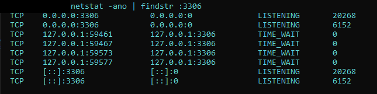
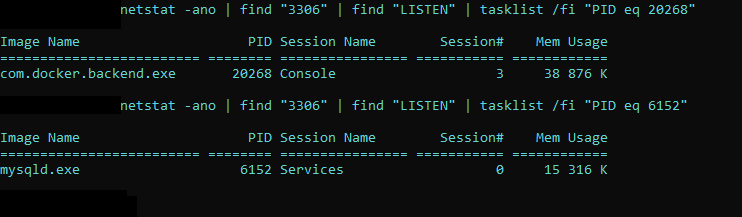

# Issues

## GSS-API Authentication Failed

<!-- TODO: Add documentation -->

### Základné informácie

Problém autorizácia nastáva v prípade, že pri pripájaní sa na MariaDB v DBeaver vypisuje chybové hlásenie typu *GSS-API Authentification failed*, alebo pri spúšťaní Spring aplikácie sa minimálne 2x zobrazí chybové hlásenie o získavaní autorizácie:

```
Acquire TGT from Cache
Principal is null
null credentials from Ticket Cache
                [Krb5LoginModule] authentication failed
Unable to obtain Principal Name for authentication
```

Táto chyba sa vyskytuje vtedy, keď port ktorý využíva MariaDB je obsadený iným procesom.

### Riešenie

1. Prejdite do príkazového riadku.
2. Zapnite docker pomocou príkazu `docker-compose up` v adresári projektu.
3. Pomocou príkazu `netstat -ano | findstr :3306` vyhľadajte všetky procesy, ktoré bežia na danom porte.

<p align="center">
    
</p>

V našom prípade nás zaujímajú procesy so socketom `[::]:3306`. Ako môžeme vidieť, na danom porte nám beží jednak docker, a jednak aj proces, ktorý nám spôsobuje chybové hlásenia.

4. Pre každý z procesov použite príkaz `netstat -ano | find "3306" | findstr "LISTEN" | tasklist /fi "PID eq <id_procesu>"`. ID procesu (PID) sa nachádza v poslednom stĺpci výpisu v predchádzajúcom kroku.
   
<p align="center">
    
</p>

Ako môžeme vidieť, proces ktorý nemá byť spustený je v tomto prípade používaný programom *mysqld.exe*. Tento proces môžeme vypnúť dvoma spôsobmi: buď vyhľadaním programu v správci úloh, alebo pomocou príkazového riadku. V prípade druhej možnosti (ktorá sa v tejto ukážke následne použije) je dobré sa uistiť či sa vypol aj samotný program.

5. Použite príkaz `taskkill /PID <id_procesu> /F`. Tento príkaz vypne daný proces. Ak sa vyskytne chybové hlásenie, tak je nutné prejsť na prvú možnosť, a to vypnúť program skrz správcu úloh.

6. Ak ste postupovali správne, tak pri výpise príkazu na výpis všetkých procesov sa zobrazí len jeden proces pre socket `[::]:3306` (3. krok).
7. Reštartuje IDE, nanovo zapnite docker a spustte Spring aplikáciu.
